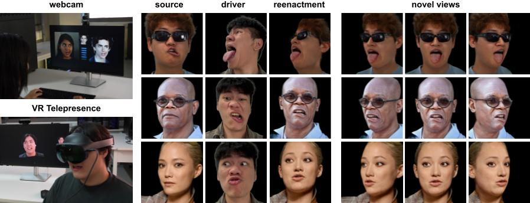

# VOODOO XP: Expressive One-Shot Head Reenactment for VR Telepresence
Phong Tran, Egor Zakharov, Long-Nhat Ho, Liwen Hu, Adilbek Karmanov, Arival Agarwal, McLean GoldWhite, Ariana Bermudez Venegas, Anh Tuan Tran, Hao Li

| [Webpage](https://mbzuai-metaverse.github.io/voodooxp) | [Paper](https://arxiv.org/abs/2405.16204) | [Video](https://www.youtube.com/watch?v=CNXctCA5RXM) | [Previous publication](https://p0lyfish.github.io/voodoo3d/) | [SIGGRAPH RTL](https://www.youtube.com/live/Gm1B5DT8kE0?si=ytI00jVZAnscMAM6&t=2657) |<br><br>



This is the official implementation of the paper "VOODOO XP: Expressive One-Shot Head Reenactment for VR Telepresence". VOODOO XP is a real-time, 3D-aware one-shot head reenactment method that generates expressive facial animations from any driver video and a single 2D portrait. This repo provides both inference and training codes, as well as the pre-trained weights of the paper.

<b>Abstract</b>: 
We introduce VOODOO XP: a 3D-aware one-shot head reenactment method that can generate highly expressive facial expressions from any input driver video and a single 2D portrait. Our solution is real-time, view-consistent, and can be instantly used without calibration or fine-tuning. We demonstrate our solution on a monocular video setting and an end-to-end VR telepresence system for two-way communication. Compared to 2D head reenactment methods, 3D-aware approaches aim to preserve the identity of the subject and ensure view-consistent facial geometry for novel camera poses, which makes them suitable for immersive applications. While various facial disentanglement techniques have been introduced, cutting-edge 3D-aware neural reenactment techniques still lack expressiveness and fail to reproduce complex and fine-scale facial expressions. We present a novel cross-reenactment architecture that directly transfers the driver's facial expressions to transformer blocks of the input source's 3D lifting module. We show that highly effective disentanglement is possible using an innovative multi-stage self-supervision approach, which is based on a coarse-to-fine strategy, combined with an explicit face neutralization and 3D lifted frontalization during its initial training stage. We further integrate our novel head reenactment solution into an accessible high-fidelity VR telepresence system, where any person can instantly build a personalized neural head avatar from any photo and bring it to life using the headset. We demonstrate state-of-the-art performance in terms of expressiveness and likeness preservation on a large set of diverse subjects and capture conditions.

<section class="section" id="BibTeX">
  <div class="container is-max-desktop content">
    <h2 class="title">BibTeX</h2>
    <pre><code>@Article{tran2024voodoo,
      title={VOODOO XP: Expressive One-Shot Head Reenactment for VR Telepresence},
      author={Tran, Phong and Zakharov, Egor and Ho, Long-Nhat and Hu, Liwen and Karmanov, Adilbek and Agarwal, Aviral and Goldwhite, McLean and Venegas, Ariana Bermudez and Tran, Anh Tuan and Li, Hao},
      journal={ACM Transactions on Graphics, Proceedings of the 17th ACM SIGGRAPH Conference and Exhibition in Asia 2024, (SIGGRAPH Asia 2024), 12/2024},
      year={2024}
}</code></pre>
  </div>
</section>

## Installation
### Requirements
- Cuda >= 11.7.
- At least 5Gb VRAM for inferencing.
- We trained our model using 7x Nvidia A6000 ADA GPUs (48Gb VRAM each).

### Setup
First, clone the repo:
```shell
git clone https://github.com/P0lyFish/voodooxp
```

To install dependencies, you can use conda:
```shell
conda env create -f environment.yml
```
or if you prefer pip:
```shell
pip install -r requirements.txt
```

Next, download the [pre-trained weights](https://mbzuai-metaverse.github.io/voodooxp) and put it in `./experiments/pretrained_weights`.

For training, TODO.

## Inferencing
To inference the pre-trained model, use the following script:
```shell
python inference.py --source_root ./assets/source_images \
                    --driver_root ./assets/driver_images \
                    --model_config_path ./configs/voodooxp.yml \
                    --render_mode driver_view \
                    --batch_size 1 \
                    --weight_path ./experiments/pretrained_weights/voodooxp_weight_v1.0.ckpt \
                    --save_root ./results/n_sources_n_drivers \
```

<details>
<summary><span style="font-weight: bold;">Command Line Arguments for train.py</span></summary>

  #### --source_root
  Path to the root of all source images. It can also be the direct path of the source image.

  #### --driver_root
  Path to the root of all driver images. It can also be the direct path of the driver image.

  #### --model_config_path
  path to the model config file (in yaml format).

  #### --render_mode
  `driver_view`: Use the pose extracted from the driver.

  `novel_view`: Ignore the pose of the driver and use a fixed trajectory that fly around the head to render.

  `frontal_view`: Ignore the pose of the driver and render at the frontal pose.

  #### --batch_size
  Inference batch size. Increase this for faster inference but this also increase the VRAM usage.

  #### --weight_path
  Path to the pre-trained weights.

  #### --save_root
  Save results into this folder.

  #### --skip_preprocess
  If your data is already aligned, you can enable this flag to skip the data preprocessing. Note that this can only be enabled with 'driver_view' and 'frontal_view' render mode.

  #### --pairwise
  If enabled, inference for every pairs of sources and drivers. If this flag is not enabled, the number of source and driver images have to be the same.

  #### --undo alignment
  If enabled, align the results back to the original crop of the driver. Can be useful for metric calculation.

</details>
<br>

We also provided a few inference example scenarios in `scripts/inference_sample_scripts.sh`.

## Training
### Dataset Preparation

### Train the lifting module

### Train the expression transferring module